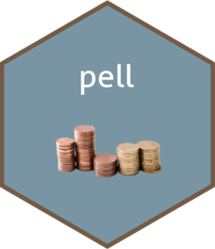

<!-- README.md is generated from README.Rmd. Please edit that file -->

# pell 

<!-- badges: start -->

[](https://github.com/Curious-Joe/pell/actions/workflows/R-CMD-check.yaml)
<!-- badges: end -->

This package contains one dataset that contains total [Pell
grant](https://www2.ed.gov/programs/fpg/index.html) distributed by
different colleges/universities over the years across the entire United
States of America.

## Installation

You can install the released version of `pell` from
[CRAN](https://cran.r-project.org/) with:

``` r
# Install the released version from CRAN
install.packages("devtools")
```

You can install the development version of `pell` from
[GitHub](https://github.com/) with:

``` r
install.packages("devtools")
devtools::install_github("Curious-Joe/pell")
```

## About the data

Data is collected and distributed by the US Department of Education. The
raw data provided in their website are non-standardized, and need some
extensive data cleaning to make them useful as a whole.

In this package, the raw data files were sourced from their website,
cleaned, standardized, and joined together into one dataset:

-   `pell`: For each year since 1999 to 2017 how much total money was
    disbursed as Pell grant by each institution across the USA.

## Example

Load the dataset:

``` r
library(pell)
data(pell)
```

Explore first 5 rows:

``` r
head(pell)
#>   STATE     AWARD RECIPIENT                               NAME SESSION YEAR
#> 1    AK  197232.9       109          Alaska Pacific University 1999-00 1999
#> 2    AK  133148.0        69 Alaska Vocational Technical Center 1999-00 1999
#> 3    AK  107287.0        72            Sheldon Jackson College 1999-00 1999
#> 4    AK 3425148.8      1920   University of Alaska - Anchorage 1999-00 1999
#> 5    AK 2441864.0      1256  University of Alaska at Fairbanks 1999-00 1999
#> 6    AK  353170.0       221  University of Alaska at Southeast 1999-00 1999
```

## References

Data originally published in:

-   US Department of Education Website:
    <https://www2.ed.gov/finaid/prof/resources/data/pell-institution.html>
